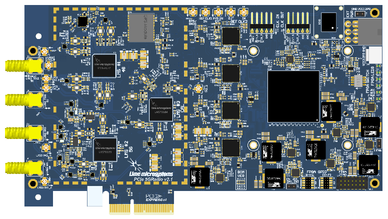

Features and Specifications
===========================

SDR Card
--------

Software Defined Radio (SDR) with integrated front end – LimeNET is built on
LimeSDR software-defined radio technology to deliver an app-enabled network
solution covering any standard from IoT to 5G. Use of Lime’s SDR platform
provides the most flexible radio hardware solution that enables numerous
applications from IoT to 5G and small-cell configurations and services. It could
be used to create on-demand network solutions where services could be easily
offered for any Telco centric services. LimeNET comes pre-equipped with a
flexible front-end module that provides filtering and amplification.

.. table:: Table 1: LimeSDR Features and Specifications.

   +---------------------------+------------------------------------------------------------------------------------------+
   |RF Chipset                 |3x Lime Microsystems `LMS7002M FPRF`_                                                     |
   +---------------------------+------------------------------------------------------------------------------------------+
   |RF LO frequency\ :sup:`1`  |30MHz – 3.8GHz                                                                            |
   +---------------------------+------------------------------------------------------------------------------------------+
   |RF channels                |2x2 MIMO for 5G, 2x2 MIMO for 4G, 2x RX for spectrum monitoring and 2x TX for calibrations|
   +---------------------------+------------------------------------------------------------------------------------------+
   |RF bandwidth               |4G: up to 40MHz                                                                           |
   +                           +------------------------------------------------------------------------------------------+
   |                           |5G: up to 100MHz                                                                          |
   +---------------------------+------------------------------------------------------------------------------------------+
   |Default                    |4G: B1, B3, B7 or B28                                                                     |
   +                           +------------------------------------------------------------------------------------------+
   |supported bands\ :sup:`2`  |5G: n48, n78\ :sup:`3`                                                                    |
   +---------------------------+------------------------------------------------------------------------------------------+
   |FPGA family                |Xilinx Artix7, `XC7A200T`_                                                                |
   +---------------------------+------------------------------------------------------------------------------------------+
   |PCIe generation            |Gen 2, x4, 2000MB/s                                                                       |
   +---------------------------+------------------------------------------------------------------------------------------+
   |Clock oscillator           |VCOCXO, VCTCXO, `CDCM6208`_                                                               |
   +---------------------------+------------------------------------------------------------------------------------------+
   |Location services          |Galileo, Glonass, GPS, Beidu                                                              |
   +---------------------------+------------------------------------------------------------------------------------------+

.. note::

   * :sup:`1`\ Continous coverage.
   * :sup:`2`\ Other bands possible by request.
   * :sup:`3`\ Subset of 3.4-3.6GHz supported by default.

x86 Subsystem
-------------

.. table:: Table 2: Typical LimeNET x86 System Features and Specifications.

   +----------------------+-----------------------------------------------------------------------------------------------+
   |CPU\ :sup:`1,2`       |`AMD, Ryzen 7 5700G, 8C/16T`_ or `Ryzen 9 5900X, 12C/24T, 4.60GHz`_                            |
   +----------------------+-----------------------------------------------------------------------------------------------+
   |Motherboard\ :sup:`1` |`GIGABYTE, X570 AORUS PRO, AT`_                                                                |
   +----------------------+-----------------------------------------------------------------------------------------------+
   |RAM\ :sup:`2`         |16GB, DDR4, 3600MHz (up to 128GB)                                                              |
   +----------------------+-----------------------------------------------------------------------------------------------+
   |Storage\ :sup:`1,2`   |500GB SATA SSD                                                                                 |
   +----------------------+-----------------------------------------------------------------------------------------------+
   |Cooling\ :sup:`1`     |Liquid/air combination                                                                         |
   +----------------------+-----------------------------------------------------------------------------------------------+
   |x86 subsystem case    |4U rackmount server chassis                                                                    |
   +----------------------+-----------------------------------------------------------------------------------------------+
   |LimeNET system case   |Indoor, IP20, Rack type, 7U size, 60x45x40cm (WxLxH). Houses all hardware parts except Antenna.|
   +----------------------+-----------------------------------------------------------------------------------------------+

.. note::

   * :sup:`1`\ Vendor may vary.                
   * :sup:`2`\ Specification may be customised.

RF Front-End
------------

.. table:: Table 3: Typical LimeNET RF Front-end Features and Specifications.

   +-----------------------------------+--------------------------------------------------------------------------+
   |Front-end module\ :sup:`1,2,3`     |Output power: <33dBm, Noise Figure: <2dBm, ACPR: >45dB\ :sup:`4`          |
   +-----------------------------------+--------------------------------------------------------------------------+
   |Front-end module supply\ :sup:`1,3`|>100W AC-DC converter                                                     |
   +-----------------------------------+--------------------------------------------------------------------------+
   |Band filter/duplexer\ :sup:`1,2,5` |Cavity type, SMA (female) output                                          |
   +-----------------------------------+--------------------------------------------------------------------------+
   |Antenna\ :sup:`1,2,6`              |MIMO, 5G ready, Frequency bands: 698-960MHz; 1710-2700MHz;                |
   +                                   +                                                                          +
   |                                   |3200-3800MHz, up to 6dBi, IP68, SMA (male), feed power handling up to 10W | 
   +-----------------------------------+--------------------------------------------------------------------------+
   |User test equipment\ :sup:`1`      |5G ready, supports 5G SA mode                                             |
   +-----------------------------------+--------------------------------------------------------------------------+
   |SIM card\ :sup:`1,7`               |2FF-4FF, Ready-to-use with LimeNET devices                                |
   +-----------------------------------+--------------------------------------------------------------------------+

.. note::

   * :sup:`1`\ Vendor may vary.
   * :sup:`2`\ Specific band or channel restrictions may vary depending on specific requirements (e.g. N78, N48, N41 etc.)
   * :sup:`3`\ Power can be changed depending on specific requirements.
   * :sup:`4`\ At maximum output power, LTE test waveform, 20MHz, PAPR 10dB.
   * :sup:`5`\ Output connector can be changed depending on specific requirements.
   * :sup:`6`\ Antenna parameters be changed depending on specific requirements.
   * :sup:`7`\ Pre-programmed SIM cards can be supplied depending on specific requirements.

4G/5G Backhaul
--------------

.. table:: Table 4: Typical LimeNET RF Front-end Features and Specifications.

   +----------------------+-----------------------------------------------------------------------------------+
   |Module\ :sup:`1`      |4G: `EM7690`_ Cat-20 LTE-Advanced Pro Module                                       |
   +                      +-----------------------------------------------------------------------------------+
   |                      |5G: `EM9191`_ 5G NR Sub-6 GHz Module                                               |
   +----------------------+-----------------------------------------------------------------------------------+
   |Data rate             |4G: Peak Download Rate 2Gb/s; Peak Upload Rate 211Mb/s                             |
   +                      +-----------------------------------------------------------------------------------+
   |                      |5G: Peak Download Rate 4.5Gb/s; Peak Upload Rate 660Mb/s                           |
   +----------------------+-----------------------------------------------------------------------------------+
   |Supported bands       |4G: B1, B2, B3, B4, B5, B7, B8, B12, B13, B14, B18, B19, B20, B21, B25, B26,       |
   +                      +                                                                                   +
   |                      |B28, B29, B30, B32, B34, B38, B39, B40, B41, B42, B43, B46, B48, B66, B71          |
   +                      +-----------------------------------------------------------------------------------+
   |                      |5G: n1, n2, n3, n5, n7, n8, n12, n20, n25, n28, n38, n40, n41, n48, n66, n71, n77, |
   +                      +                                                                                   +
   |                      |n78, n79                                                                           |
   +----------------------+-----------------------------------------------------------------------------------+
   |Antenna\ :sup:`1,2,3` |MIMO, 5G ready, Frequency bands: 698-960MHz; 1710-2700MHz;                         |
   +                      +                                                                                   +
   |                      |3200-3800MHz, up to 6dBi, IP68, SMA (male), feed power handling up to 10W          |
   +----------------------+-----------------------------------------------------------------------------------+

.. note::

   * :sup:`1`\ Vendor may vary.
   * :sup:`2`\ Specific band or channel restrictions may vary depending on specific requirements (e.g. N78, N48, N41 etc.)
   * :sup:`3`\ Antenna parameters can be changed to meet specific requirements.

Software
--------

.. table:: Table 5: Typical LimeNET Software Features and Specifications.

   +---------------------------+---------------------------------------------------------------------------------+
   |4G/5G stack                |Amarisoft: eNB/gNB, EPC/5GC functionality (pre-installed)                        |
   +---------------------------+---------------------------------------------------------------------------------+
   |Front-end module control   |Lime Microsystems: gain, power control; automatic output power level limitation; |
   +                           +                                                                                 +
   |                           |temperature and forward, reverse power information; SWR, over temperature, over  |
   +                           +                                                                                 +
   |                           |power warnings (pre-installed)                                                   |
   +---------------------------+---------------------------------------------------------------------------------+
   |Operating system\ :sup:`1` |Ubuntu LTS (pre-installed)                                                       |
   +---------------------------+---------------------------------------------------------------------------------+

.. note::

   * :sup:`1`\ Ubuntu is required for LimeNET app store support.

.. _LMS7002M FPRF: https://limemicro.com/technology/lms7002m/
.. _XC7A200T: https://www.xilinx.com/products/silicon-devices/fpga/artix-7.html#productTable
.. _CDCM6208: https://www.ti.com/product/CDCM6208
.. _AMD, Ryzen 7 5700G, 8C/16T: https://www.amd.com/en/products/apu/amd-ryzen-7-5700g
.. _Ryzen 9 5900X, 12C/24T, 4.60GHz: https://www.amd.com/en/products/cpu/amd-ryzen-9-5900x 
.. _GIGABYTE, X570 AORUS PRO, AT: https://www.gigabyte.com/Motherboard/X570-AORUS-PRO-rev-11-12
.. _EM7690: https://www.sierrawireless.com/products-and-solutions/embedded-solutions/products/em7690/
.. _EM9191: https://www.sierrawireless.com/products-and-solutions/embedded-solutions/products/em9191/
