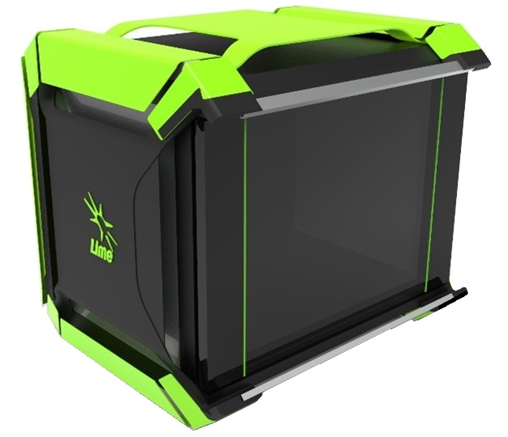

.. toctree::
   :maxdepth: 2
   :hidden:

   Overview <self>
   structure
   features
   ecosystem

Overview
========

LimeNET is a complete network-in-a-box solution built on the field proven Lime
Software Defined Radio (LimeSDR) boards and modules. It offers an array of
qualified hardware solutions by combining the LimeSDR boards with commodity
compute platforms and additional components such as Power Amplifiers and
Duplexers for a complete product offering. LimeNET products run Ubuntu Core and
can be integrated with both private and public networks. There is also a
reference App store featuring applications from Lime and partners that are all
qualified and certified by Lime.

LimeNET replaces proprietary and custom equipment and software with open-source
commodity hardware and software, thereby providing a radical alternative model
to the closed wireless network equipment offered by incumbent vendors today.

LimeNET replaces proprietary and custom equipment and software with open-source
commodity hardware and software, thereby providing a radical alternative model
to the closed wireless network equipment offered by incumbent vendors today.
