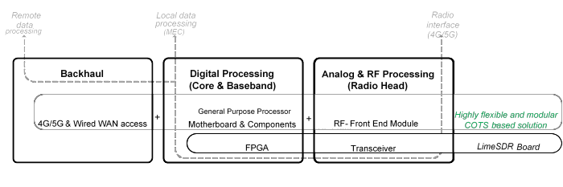

Structure
=========

LimeNET replaces proprietary and custom equipment and software with open-source
commodity hardware and software, thereby providing a radical alternative model
to the closed wireless network equipment offered by incumbent vendors today.

The Transceiver, Front End and Digital Processing are constructed in a modular
fashion using commercially available off-the-shelf (COTS) components. LimeNET
adopts a collection of both open-source and proprietary software solutions for
the implementation of 4G/5G baseband and core functions on x86 based
processors/servers which makes it an ideal platform for any mobile edge compute
(MEC) deployment. On this basis, LimeNET is not vendor-locked and can be
incorporated as part of the IT infrastructure within any organization,
maintained and upgraded by IT personnel. Furthermore, the Front End Module
(Power Amplifier and Filters) could be customized for any band of interest and
geographical locations. This allows LimeNET to deliver unparalleled flexibility
as an standalone network-in-a-box solution or as part of an existing networks
where backhauling is possible via wired or 4G/5G radio links.
